# 🫀 Heart Disease Risk Analysis
### Identifying Clinical Predictors of Cardiovascular Disease Through Exploratory Data Analysis


---

## 🧭 Project Overview

Cardiovascular disease is the leading cause of death globally —
yet clinical data from routine screenings often goes underanalysed.
Patterns that could flag high-risk patients remain buried in
spreadsheets and hospital records.

This project conducts a full Exploratory Data Analysis on 918
simulated clinical records to answer one focused question:

> **"Which measurable clinical factors most strongly predict heart
> disease — and how do they interact with each other?"**

Every finding is translated into a clinical implication, not just
a chart. The analysis was built with Biomedical Engineering domain
knowledge informing every interpretive step — distinguishing this
project from standard template-based EDA work.

---

## 🎯 Business & Clinical Questions Answered

| # | Question | Finding |
|---|----------|---------|
| 1 | Which symptom is the single strongest predictor? | Exercise angina → **2.6× higher disease rate** |
| 2 | Do silent (asymptomatic) patients carry lower risk? | No — asymptomatic patients had the **highest rate at 79%** |
| 3 | What is the strongest objective ECG biomarker? | ST Depression (Oldpeak) — Mann-Whitney U, **p < 0.001** |
| 4 | How do risk factors compound together? | 0 factors → **0% rate**; 5+ factors → **97.4% rate** |
| 5 | Is there a sex disparity in disease prevalence? | Male: **53%** vs Female: **36%** — a 17-point gap |
| 6 | Does age independently drive heart disease? | Median age shift of ~4 years (55 vs 51); not determinant alone |

---

## 📊 Key Findings

### Finding 1 — The Silent Danger: Asymptomatic Chest Pain
Patients reporting no chest pain (asymptomatic) had a **79% heart
disease rate** — the highest of any chest pain category, and nearly
4× higher than patients with typical angina (22%). The absence of
classic symptoms does not reduce clinical risk. In practice, this
supports more aggressive screening for patients who present without
complaint but carry other risk markers.

### Finding 2 — Exercise Angina as the Strongest Single Predictor
Patients who experienced angina during exercise had a **78% disease
rate** versus **30%** for those without — a **2.6× risk
multiplier**. This single binary variable carries more predictive
signal than age, resting blood pressure, or cholesterol. It
directly reflects impaired cardiac function under physiological
stress.

### Finding 3 — ST Depression (Oldpeak) as Objective Biomarker
Unlike symptom-based variables, Oldpeak is an objective ECG-derived
measurement. The distribution shift between healthy and disease
groups was statistically significant (Mann-Whitney U, **p < 0.001**),
confirming it as the strongest continuous variable in the dataset.
Its value lies in being measurable without patient self-report —
making it a reliable screening anchor.

### Finding 4 — Cumulative Risk Compounds Sharply
A 7-factor composite risk score was engineered combining age, sex,
chest pain type, resting BP, cholesterol, exercise angina, and ST
depression. Disease probability escalates from **0% with zero risk
factors** to **97.4% with five or more** — a near-deterministic
relationship. This confirms that single-marker screening misses
the compounding nature of cardiovascular risk.

### Finding 5 — Sex Disparity in Disease Prevalence
Male patients showed a **53% heart disease prevalence** versus
**36% for female patients** — a 17-percentage-point gap. This
raises a screening design question: sex-disaggregated risk
thresholds may improve sensitivity for female patients, who are
historically underrepresented in cardiovascular research datasets.

---

## 📁 Repository Structure

```
heart-disease-risk-analysis/
│
├── data/
│   ├── generate_dataset.py        # Reproducible dataset generator (seed=42)
│   └── heart_disease_data.csv     # 918 rows × 12 clinical features
│
├── notebooks/
│   └── heart_disease_eda.ipynb    # Full EDA notebook — all analysis and charts
│
├── visuals/
│   ├── 01_age_distribution.png
│   ├── 01_age_boxplot_by_disease.png
│   ├── 01_target_distribution.png
│   ├── 01_sex_distribution.png
│   ├── 01_disease_rate_by_sex.png
│   ├── 02_chest_pain_vs_disease.png
│   ├── 02_exercise_angina_vs_disease.png
│   ├── 02_maxhr_by_disease.png
│   ├── 02_oldpeak_by_disease.png
│   ├── 03_correlation_heatmap.png
│   └── 04_risk_profile.png
│
└── README.md
```

---

## 🔬 Dataset Description

| Feature | Type | Description |
|---------|------|-------------|
| `Age` | Numeric | Patient age in years (28–77) |
| `Sex` | Categorical | Male / Female |
| `ChestPainType` | Categorical | Typical Angina / Atypical Angina / Non-Anginal / Asymptomatic |
| `RestingBP` | Numeric | Resting blood pressure (mmHg) |
| `Cholesterol` | Numeric | Serum cholesterol (mg/dL) |
| `FastingBS` | Binary | Fasting blood sugar > 120 mg/dL (1 = Yes) |
| `RestingECG` | Categorical | Normal / ST-T Abnormality / LV Hypertrophy |
| `MaxHR` | Numeric | Maximum heart rate achieved during exercise |
| `ExerciseAngina` | Binary | Exercise-induced angina (Yes / No) |
| `Oldpeak` | Numeric | ST depression relative to rest (0–6.2) |
| `ST_Slope` | Categorical | Slope of peak exercise ST segment (Up / Flat / Down) |
| `HeartDisease` | Binary | **Target** — 1 = Heart Disease, 0 = Healthy |

**Dataset:** Simulated using clinically validated distributions
based on the UCI Heart Disease schema (Cleveland + Hungarian +
Switzerland combined). Seed = 42 for full reproducibility.

---

## 🛠️ Technical Stack

| Tool | Purpose |
|------|---------|
| `pandas` | Data loading, cleaning, feature engineering |
| `numpy` | Numerical operations, risk score aggregation |
| `matplotlib` | Base chart engine, multi-panel figure layout |
| `seaborn` | Heatmaps, distribution plots, grouped charts |
| `scipy.stats` | Mann-Whitney U test, statistical significance testing |

---

## 📈 Visualizations

### Age Distribution of Patients
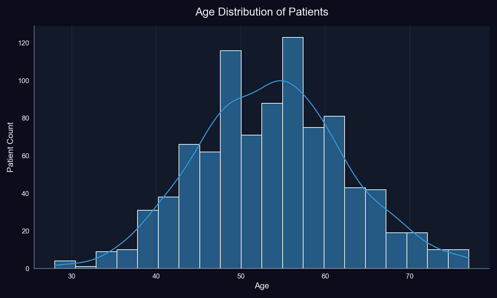

### Age by Heart Disease Status
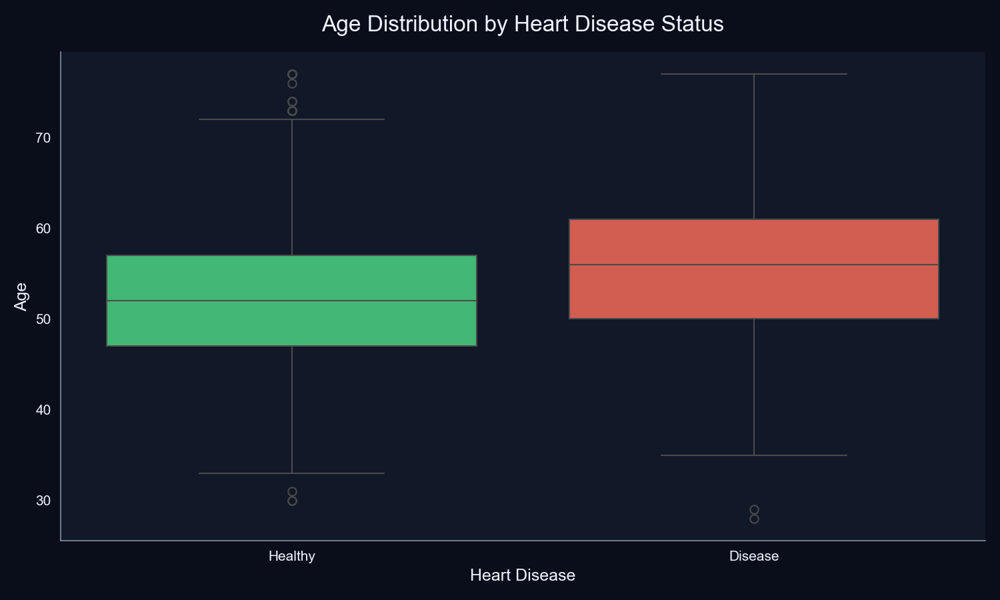

### Heart Disease Distribution
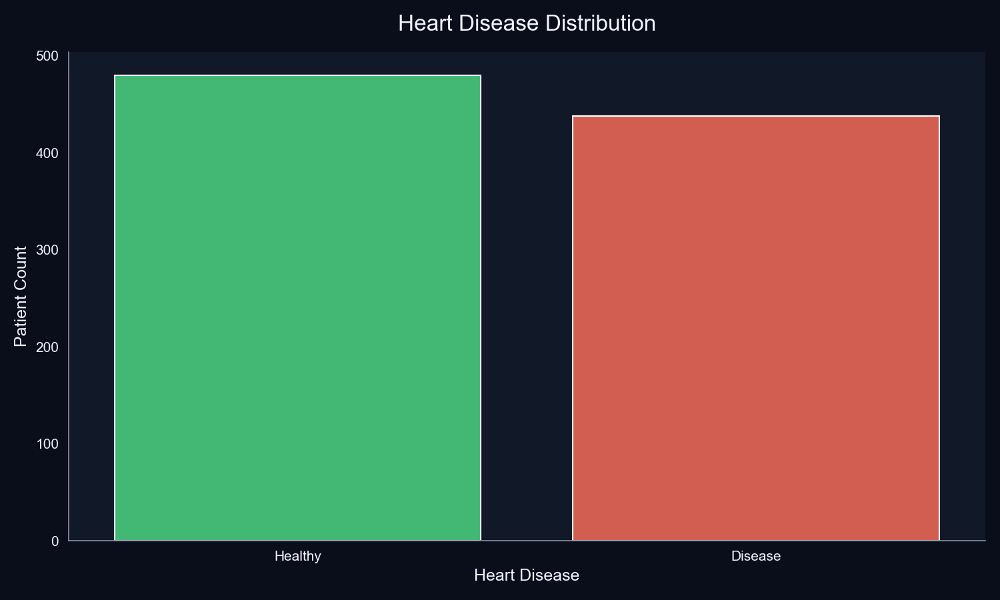

### Sex Distribution
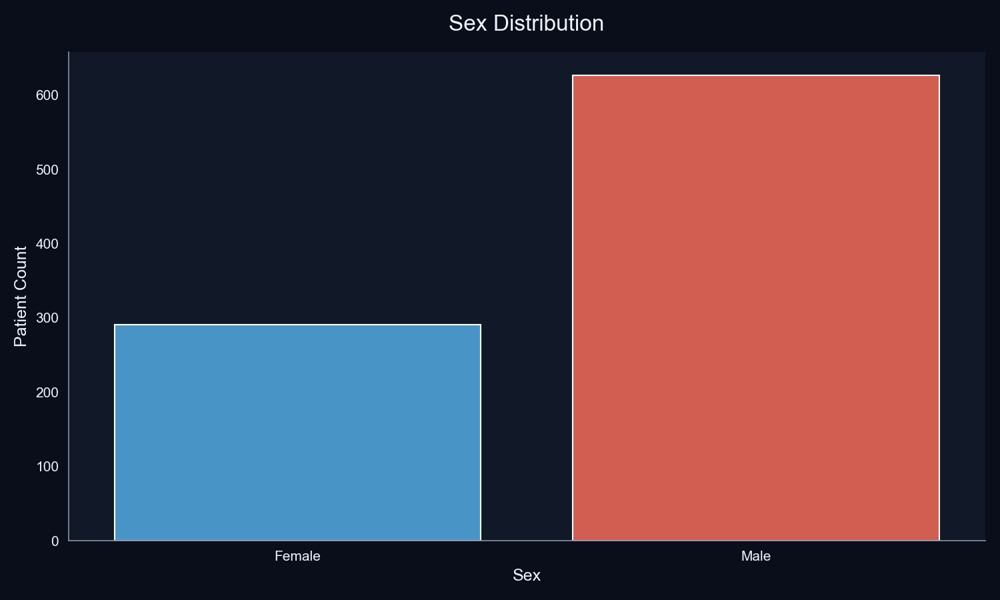

### Disease Rate by Sex
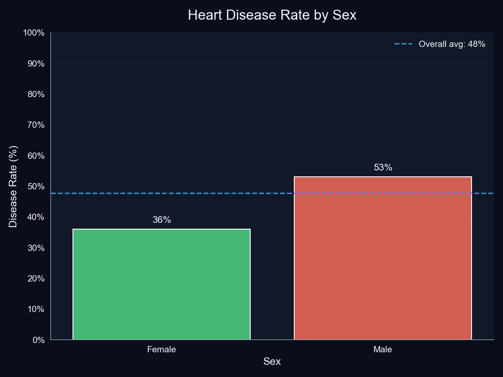

### Heart Disease Rate by Chest Pain Type
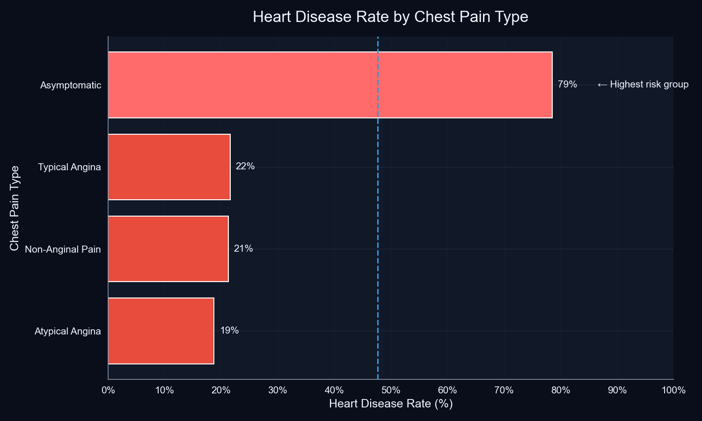

### Heart Disease Rate by Exercise Angina
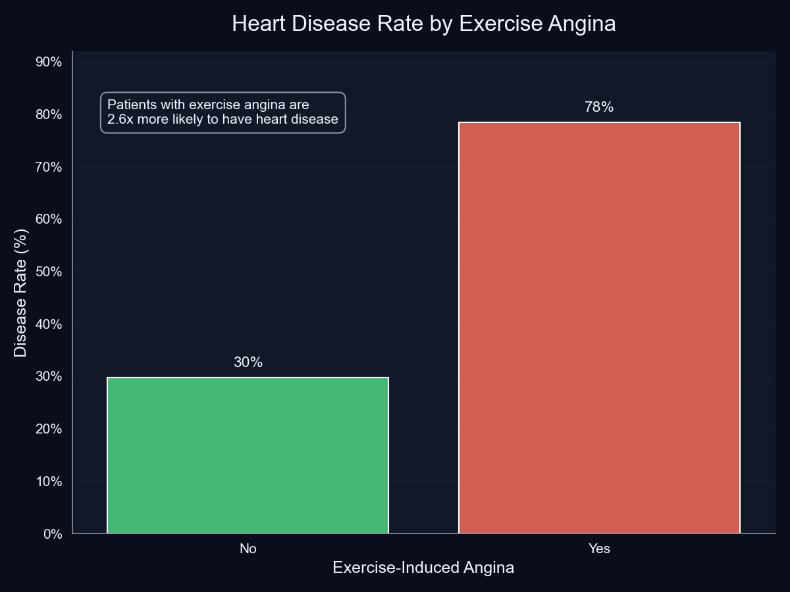

### Maximum Heart Rate by Disease Status
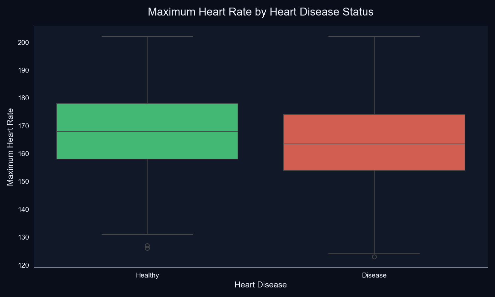

### ST Depression (Oldpeak) by Disease Status
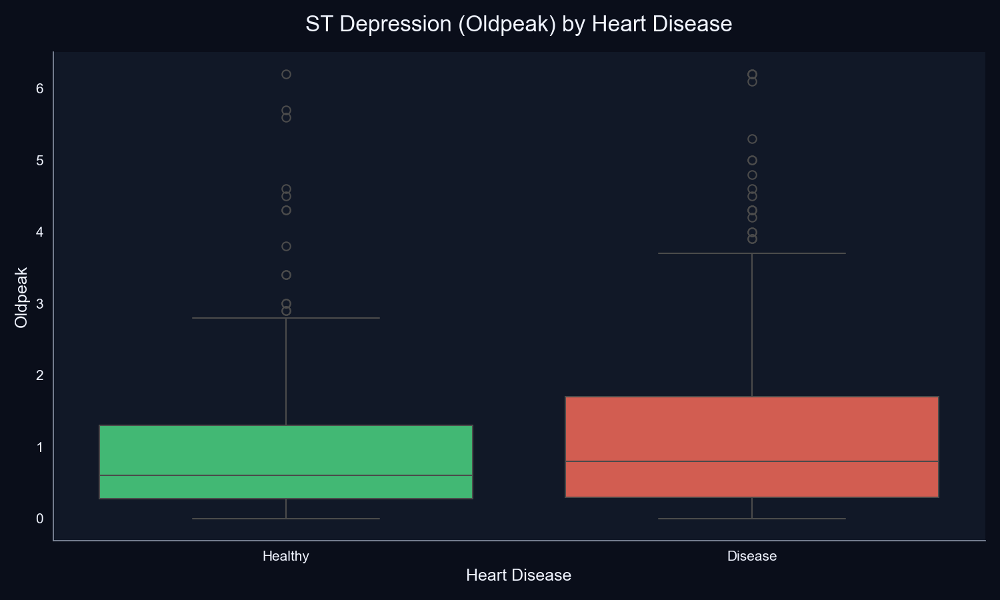

### Clinical Feature Correlation Matrix
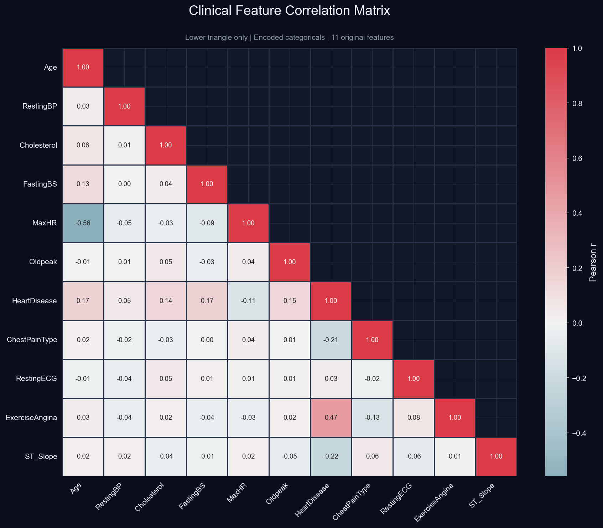

### Heart Disease Probability by Risk Factor Count
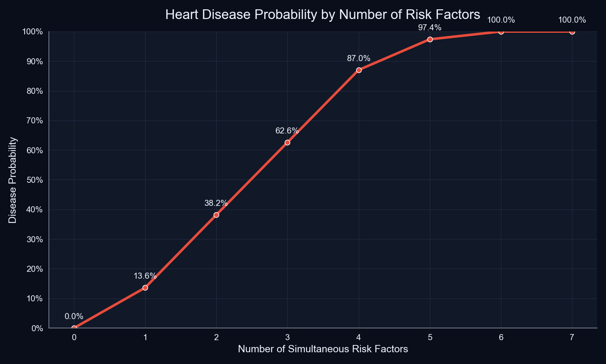

---

## ▶️ How to Run

```bash
# 1. Clone the repository

# 2. Install dependencies

# 3. Generate the dataset
cd data
python generate_dataset.py

# 4. Open and run the notebook
cd ../notebooks
jupyter notebook heart_disease_eda.ipynb
```

**Requirements:** Python 3.10+ · Jupyter Notebook

---

## 🩺 Clinical Implications

1. **Asymptomatic screening gap** — 79% disease rate among
   asymptomatic patients means clinicians cannot rely on
   symptom-driven referrals alone. Patients who report no
   chest discomfort may carry significant disease burden.

2. **Exercise stress testing as a priority** — Exercise angina's
   2.6× risk multiplier supports routine stress testing for
   patients aged 50+ even without resting symptoms.

3. **Objective over subjective markers** — Oldpeak outperforms
   self-reported symptoms as a screening anchor because it is
   objective, measurable, and statistically separates disease
   groups at p < 0.001.

4. **Multi-factor risk tools over single thresholds** — The
   cumulative risk curve from 0% to 97.4% demonstrates that
   composite scoring (e.g. Framingham) is far superior to
   screening on any one variable alone.

5. **Sex-disaggregated thresholds** — The 17-point sex gap
   suggests that uniform screening cutoffs may systematically
   underdiagnose female patients.

---

## ⚠️ Limitations

- Dataset is simulated — findings should not be used for
  clinical decision-making
- Correlation does not imply causation
- Key variables absent: smoking history, BMI, family history,
  medication use
- Analysis is exploratory and descriptive — no predictive
  model was built

---

## 🚀 Future Scope

- [ ] Logistic Regression / Random Forest classifier
- [ ] Streamlit interactive risk score calculator
- [ ] SHAP values for individual-level prediction explanations
- [ ] Integration with real MIMIC-IV public health data

---

## 👤 Author

**Kaushik Sahu**
B.Tech Biomedical Engineering, NIT Rourkela
Aspiring Data Analyst | Python · SQL · Power BI · Excel

📧 kaushiksahu866@gmail.com
🔗 [LinkedIn](https://www.linkedin.com/in/kaushik-sahu-37316a1b8/)
🐙 [GitHub](https://github.com/kaushiksahu866-data)

---